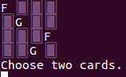

#Memory

This is a memory card game, written in Ruby, using the colorize gem, and complete with RSpec tests.  To play it in your CLI; just navigate into the "lib" folder, and run "ruby game.rb".  The cards have been assigned numbers, from 0 to 15; try out pairs of cards by typing in their numbers, and find out whether they match!

</img>
